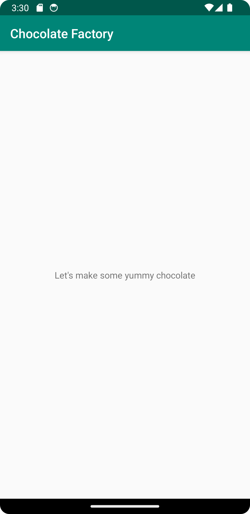

# Rapport
Ändrat namnet på appen under strings.xml från "Hello" till "Chocolate Factory", sedan gjort en commit. 
Därefter ändrat texten (Textview) som ligger under layout/activity_main.xml från att vara detsamma
som appens namn till att istället vara "Let's make some yummy chocolate"

```
<resources>
    <string name="app_name">Chocolate Factory</string>
</resources>

 <TextView
        android:layout_width="wrap_content"
        android:layout_height="wrap_content"
        android:text="Let's make some yummy chocolate"
```



